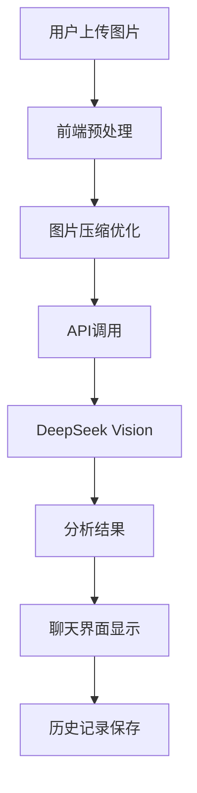

# AI助手图片识别系统实现方案

## 项目概述

本文档为AI助手添加图片识别功能的详细OpenSpec提案。该功能将允许用户上传图片并通过集成的视觉AI模型进行分析，大幅扩展助手的应用场景。

## 功能特性

### 核心功能
- **图片上传界面**：支持拖拽上传和文件选择
- **视觉AI分析**：集成DeepSeek Vision API进行图片理解
- **图片预处理**：自动压缩、格式转换和优化
- **混合媒体对话**：支持图片+文本的组合交互
- **历史记录管理**：完整保存包含图片的对话历史

### 技术亮点
- **智能压缩**：客户端图片优化，减少API调用成本
- **多格式支持**：JPG、PNG、WebP、GIF等主流格式
- **错误处理**：完善的异常处理和用户提示
- **性能优化**：图片缓存和懒加载机制

## 实现计划

### 第一阶段：基础功能 (1-2周)
- 图片上传界面开发
- 基础图片处理功能
- API集成和测试

### 第二阶段：高级功能 (2-3周)
- 聊天系统集成
- 历史记录管理
- 性能优化

### 第三阶段：完善和测试 (1周)
- 全面测试
- 用户文档
- 部署准备

## 预期效果

通过图片识别功能，AI助手将能够：
- 分析图表、截图等视觉内容
- 回答"这是什么"类型的图片问题
- 提供图片描述和细节解释
- 结合图片进行更有意义的对话

## 技术架构

## 资源需求

- **开发时间**：4-6周
- **API成本**：视觉模型调用费用（按token计费）
- **存储空间**：图片缓存和历史记录存储
- **测试资源**：各种类型和尺寸的测试图片

---

## OpenSpec 详细文档

完整的OpenSpec提案已在以下位置生成：

- **提案文档**：`openspec/changes/add-image-recognition/proposal.md`
- **技术设计**：`openspec/changes/add-image-recognition/design.md`
- **需求规格**：`openspec/changes/add-image-recognition/specs/image-recognition/spec.md`
- **任务清单**：`openspec/changes/add-image-recognition/tasks.md`

该提案已通过OpenSpec严格验证 (`openspec validate add-image-recognition --strict`)，所有文档已转换为中文版本，可以开始实施开发工作。